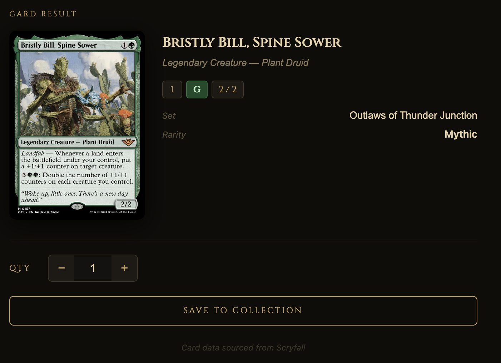

1: Hosting & Infrastructure
For my hosting and infrastructure I chose to use Render for my hosting and Supabase for my infrastructure. They both have good enough free teirs for me to run this project for this class duration. Render is also faster and has more minimal configuration compared to the google hosting site. 

2: Database
I desgin the database to hold as much necessary information from the cards as possibile because I'm also planning on adding a filtering feature inside the collections which can filter by mana, toughness/durability, etc. Each card is also linked to a user id so when each users look at their collection, they're only see cards that are theirs. 

3: Frontend Design / UI
The layout is split into two columns, the upload area on the left and the card result on the right. This design choice means the user never loses sight of the upload area while reviewing the identified card, making the scanning workflow feel fast and continuous. Once a card is identified, the Scryfall card image is displayed prominently alongside the card details (name, mana cost, type line, set).

I chose to pull card images from Scryfall rather than saving the user's uploaded photo. This gives a cleaner, consistent look in the collection since all cards display the official high quality card art regardless of how blurry or poorly lit the user's photo was.

